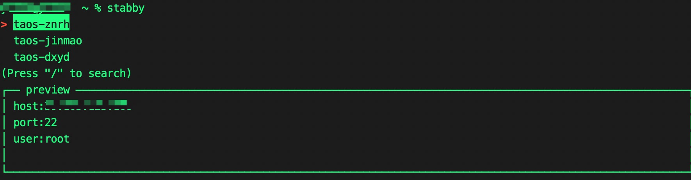

# Simple Tabby

A hepler tool to manage many remote ssh server.

when you open a native terminal on unix system , stabby can list all remote ssh server that you have configed as a pretty table. Then you can choose one to login.

You will get more infomation about every remote ssh server depend on what's your describe for the server 

# Why

I just need a gadget for my work . In my work, i need to manage many remote server machines that deployed some application, such as java application,mysql and so on.
when i decided to connect some machines, I spend a lot of time checking which applications are deployed on each server
it's making me miserable. Tabby has wonderful **Profiles & connections** feature, but there no space to remark more information
for every machine or connection. I still need another document to manage information that can not hold with Tabby.

# Install

```shell
pip install stabby
```

# Usage

## add your first remote server config 
run command `stabby add ` , follow promotes input server configuration , like below:
```shell
usage: stabby add [-h] -s S -p P [-port PORT] [-u U] [-n N]                                                    
                                                                                                        
optional arguments:                                                                                            
  -h, --help  show this help message and exit                                                                  
  -s S        remote server host                                                                               
  -p P        remote server password                                                                           
  -port PORT  remote server ssh port                                                                           
  -u U        remote server user name                                                                          
  -n N        remote server name   
```
example :
```shell
stabby add -s 192.168.1.253 -p password123 -n dev
```

## connect to remote server

run command `stabby` ,you can see as below:



you can select one remote server that you have added to connect by **KEY_UP** 、**KEY_DOWN** or **KEY_LEFT** 、**KEY_RIGHT** 

as you also can open ssh tunnue with `-t` command arg ,for example:
```shell
# stabby -t localport:remoteport
stabby -t 6041:5041
```

# How does it work

It's so easy. Default , stabby(simple_tabby) loads config file under `$USER_HOME/.simple_tabby/default.json`, file content like below:

```json
[
  {
    "title": "title for remote server",
    "host": "remote server ip or host",
    "port": 22,
    "user": "remote user ,default is root",
    "password": "remote password",
  }
]
```

when stabby is running, it loads file as json objects,let user can see all server
